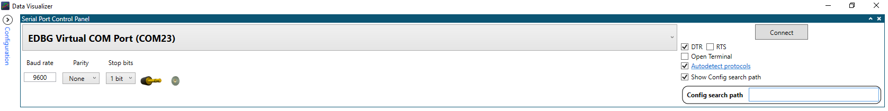
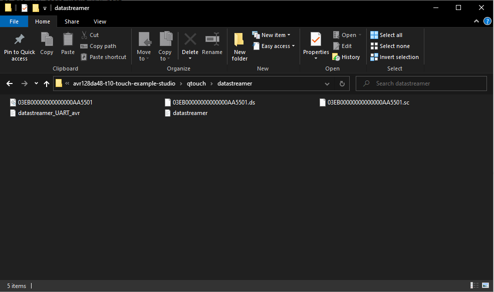

<!-- Please do not change this logo with link -->

# Touch Example using T10 and AVR128DA48 Curiosity Nano

This example demonstrates touch application on AVR128DA48 Curiosity Nano, Curiosity Nano Touch Adapter Kit and T10 extension board. The example project provides user feedback to touch using the T10 onboard LEDS, and via a PC running Microchip MPLAB® Data Visualizer. 
## Related Documentation

- AVR128DA48 Curiosity Nano user guide [(DS50002971B)](https://ww1.microchip.com/downloads/en/DeviceDoc/AVR128DA48-Curiosity-Nano-UG-DS50002971B.pdf)
- Curiosity Nano Touch Adapter Kit user guide [(DS40002191A)](https://ww1.microchip.com/downloads/en/DeviceDoc/40002191A.pdf)
- T10 Xplained Pro user guide [(DS40002180A)](https://ww1.microchip.com/downloads/en/DeviceDoc/40002180A.pdf)
- MPLAB® Data Visualizer user guide [(Data Visualizer user guide)](https://www.microchip.com/content/dam/mchp/documents/DEV/ProductDocuments/UserGuides/MPLAB_Data_Visualizer_50003001A.pdf)
## Software Used

- Microchip Studio 7 7.0.2542 or later [(microchip-studio-for-avr-and-sam-devices)](https://www.microchip.com/en-us/development-tools-tools-and-software/microchip-studio-for-avr-and-sam-devices)
- AVR-GCC 3.62 or newer toolchain [(Toolchains for AVR)](https://www.microchip.com/en-us/development-tools-tools-and-software/gcc-compilers-avr-and-arm)
- AVR-Dx_DFP (1.6.76) or later [(packs.download.microchip.com)](https://packs.download.microchip.com/)
- MPLAB® Data Visualizer [(Data Visualizer)](https://www.microchip.com/en-us/development-tools-tools-and-software/embedded-software-center/mplab-data-visualizer)
## Hardware Used

- AVR128DA48 Curiosity Nano [(DM164151)](https://www.microchip.com/DevelopmentTools/ProductDetails/PartNO/DM164151)
- Curiosity Nano Touch Adapter Kit [(AC80T88A)](https://www.microchip.com/DevelopmentTools/ProductDetails/PartNO/AC80T88A)
- T10 Xplained Pro Extension Kit [(AC47H23A)](https://www.microchip.com/developmenttools/ProductDetails/AC47H23A)

## Setup

1. Connect T10 to Curiosity Nano Touch Adapter Kit.
2. Connect Curiosity Nano Touch Adapter Kit to AVR128DA48 Curiosity Nano.
3. Connect PC to the MCU board Debug USB port.

## Operation

1. Open the .atsln file in Microchip Studio.
2. Build the solution and program the device.
3. Open MPLAB® Data Visualizer and configure Serial Port Control Panel (above):
   - Autodetect Protocols = true 
   - Show Config path = true
4. Connect.

5. When prompted, navigate to "\avr128da48-t10-touch-example-studio\qtouch\datastreamer" and select folder (above)

## Summary

This example has illustrated how to use the AVR128DA48 Curiosity Nano with T10 extension board.